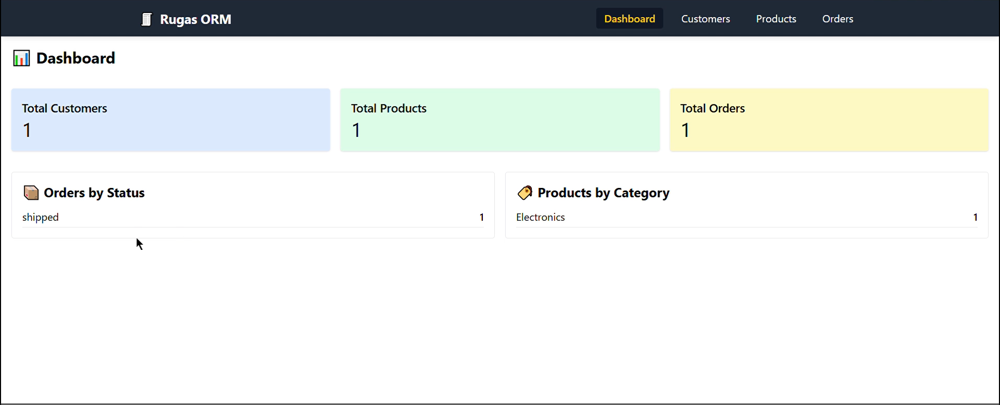
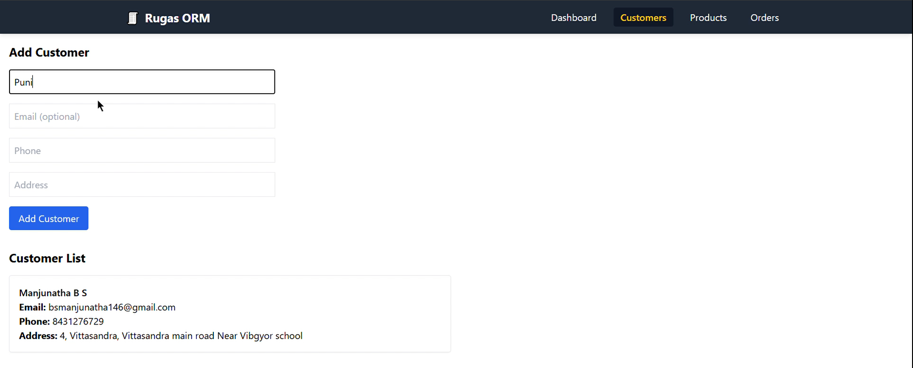
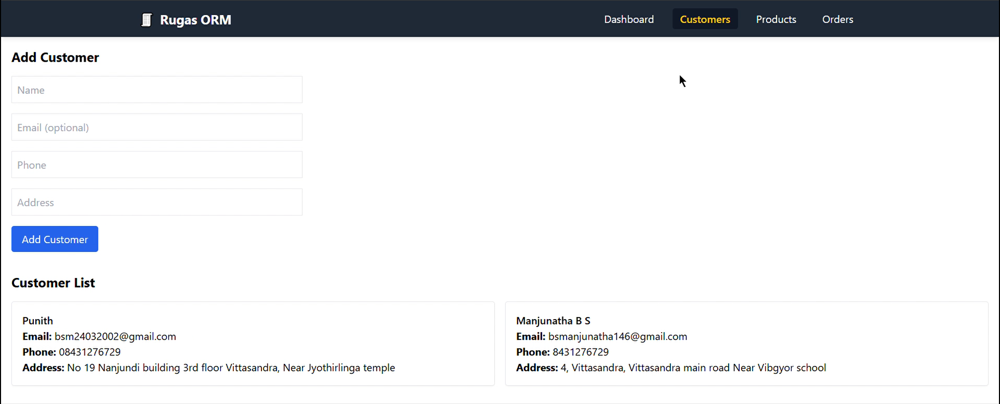
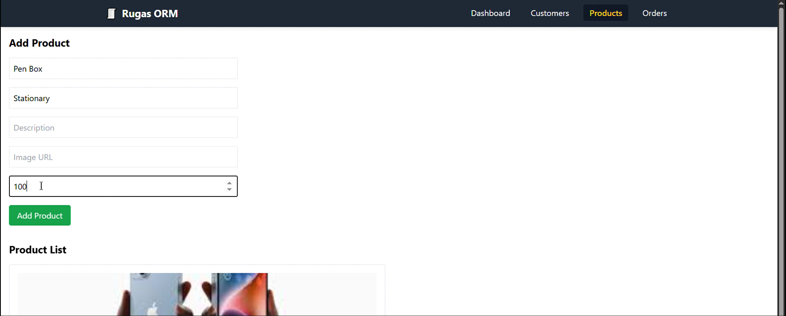
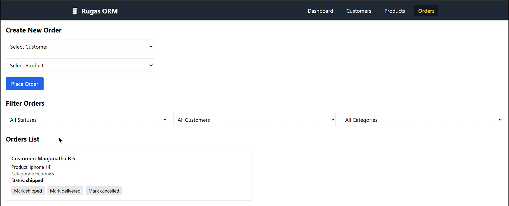
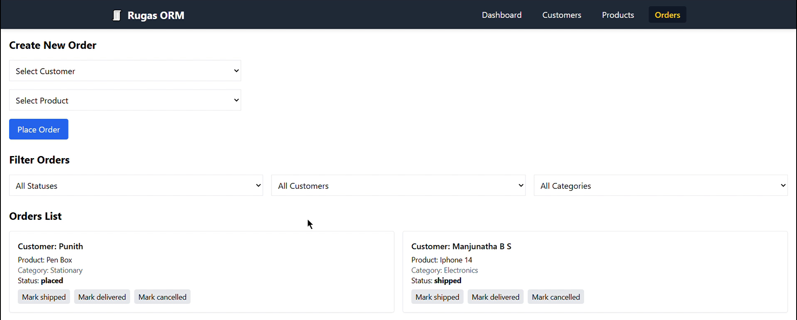

# RUGAS ORM Demo

## Screenshots

Below are screenshots of the application in action:

<p align="center">
  
  <br>
  
  <br>
  
  <br>
  
  <br>
  
  <br>
  
</p>

This project is a full-stack demo application for RUGAS company, created as an assignment for a Full Stack Internship. Here, ORM stands for **Order Management**. The app consists of a React frontend and a Node.js/Express backend, demonstrating basic CRUD operations for customers, orders, and products.

## Project Structure

```
client/   # React frontend (Vite + Tailwind CSS)
server/   # Node.js backend (Express + Mongoose)
```

## Features
- Customer, Order, and Product management
- RESTful API with Express.js
- MongoDB database connection
- React frontend with context and reusable components
- Tailwind CSS for styling

## Prerequisites
- Node.js (v16 or higher recommended)
- npm or yarn
- MongoDB (local or remote)

## Getting Started

### 1. Clone the repository
```powershell
git clone <repo-url>
cd rugas-orm-demo
```

### 2. Setup the Backend
1. Navigate to the server folder:
   ```powershell
   cd server
   ```
2. Install dependencies:
   ```powershell
   npm install
   ```
3. Configure environment variables:
   - Edit `.env` (already present) to set your MongoDB URI and server port if needed.
4. Start the backend server:
   ```powershell
   npm start
   ```
   The server will run on `http://localhost:5000` by default.

### 3. Setup the Frontend
1. Open a new terminal and navigate to the client folder:
   ```powershell
   cd ../client
   ```
2. Install dependencies:
   ```powershell
   npm install
   ```
3. Start the frontend development server:
   ```powershell
   npm run dev
   ```
   The app will run on `http://localhost:5173` by default.

## Usage
- Access the frontend at `http://localhost:5173`.
- The frontend communicates with the backend API at `http://localhost:5000`.
- You can manage customers, orders, and products through the UI.

## Folder Overview
- `client/` - React app (Vite, Tailwind CSS)
- `server/` - Express API, Mongoose models, controllers, and routes

## Environment Variables
The backend uses a `.env` file for configuration:
```
PORT=5000
MONGO_URI=mongodb://localhost:27017/rugas
```

## License
This project is for demonstration purposes only.
